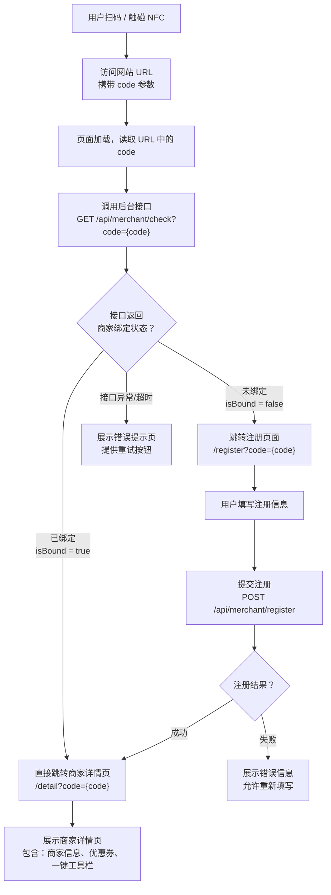

# 碰一碰好评卡 · C端产品功能说明书

> 适用于 AI 自动化功能测试的结构化需求文档

**版本：v1.0 | 日期：2026-08-03 | 文档类型：功能测试说明书**

---

## 目录

1. [概述与系统入口](#1-概述与系统入口)
2. [核心业务流程](#2-核心业务流程)
3. [功能模块详细说明](#3-功能模块详细说明)
   - 3.1 [扫码/NFC识别入口](#31-扫码nfc识别入口)
   - 3.2 [商家绑定状态校验](#32-商家绑定状态校验)
   - 3.3 [商家注册页面](#33-商家注册页面)
   - 3.4 [商家详情页面](#34-商家详情页面)
   - 3.5 [优惠券领取](#35-优惠券领取)
   - 3.6 [一键工具栏](#36-一键工具栏)
4. [接口定义](#4-接口定义)
5. [功能测试用例](#5-功能测试用例)
6. [异常场景与边界条件](#6-异常场景与边界条件)

---

## 1. 概述与系统入口

碰一碰好评卡 C端产品是面向**终端消费者**的轻量级 Web 应用（后续将打包为微信小程序）。用户通过**扫描二维码**或**触碰 NFC 标签**两种方式进入系统，系统根据 URL 携带的 `code` 参数判断商家绑定状态，并引导用户完成注册或直接进入详情页。

### 系统入口一览

| 入口方式 | 触发条件 | URL 格式 | 说明 |
|----------|----------|----------|------|
| 扫描二维码 | 用户使用手机摄像头或微信扫一扫扫描二维码 | `https://{domain}/?code={merchant_code}` | 二维码由后台管理系统生成，每个商家对应唯一二维码 |
| 触碰 NFC 标签 | 用户使用支持 NFC 的手机触碰 NFC 标签/卡片 | `https://{domain}/?code={merchant_code}` | NFC 标签中写入的 URL 与二维码相同，识别后跳转浏览器/微信内置浏览器 |

> **关键约定：** 两种入口方式最终访问的 URL 格式一致，均携带 `code` 参数。该参数是后台系统为每个商家生成的唯一标识码，用于后续所有绑定校验和业务逻辑。

---

## 2. 核心业务流程



*图 1：C端核心业务流程图*

### 页面路由总览

| 路由路径 | 页面名称 | 进入条件 | 必需参数 |
|----------|----------|----------|----------|
| `/` | 入口页（分发页） | 扫码/NFC 进入 | `code` |
| `/register` | 商家注册页 | code 未绑定 | `code` |
| `/detail` | 商家详情页 | code 已绑定，或注册成功 | `code` |
| `/error` | 错误提示页 | 接口异常或 code 无效 | — |

---

## 3. 功能模块详细说明

### 3.1 扫码/NFC识别入口

#### 3.1.1 功能描述

用户通过**扫描二维码**或**触碰 NFC 标签**进入系统。系统从 URL 中提取 `code` 参数，作为后续所有业务逻辑的商家标识。

#### 3.1.2 页面加载时序

1. **页面初始化** — 前端页面加载完成，解析 `window.location.search` 获取 URL 中的 `code` 参数。
2. **参数校验** — 校验 `code` 参数是否存在且格式合法（非空、长度合理）。若 `code` 缺失或格式异常，直接展示错误提示页。
3. **显示加载状态** — 页面展示 loading 动画，文案为"正在识别商家信息…"，防止用户误操作。
4. **调用绑定校验接口** — 携带 `code` 参数请求后台接口，进入绑定状态校验流程。

#### 3.1.3 页面元素

| 元素 | 类型 | 说明 | 预期行为 |
|------|------|------|----------|
| Loading 动画 | 视觉元素 | 居中旋转加载图标 | 接口请求期间持续显示 |
| 加载文案 | 文本 | "正在识别商家信息…" | 位于 loading 图标下方 |
| 品牌 Logo | 图片 | 碰一碰好评卡 Logo | 页面顶部居中展示 |

---

### 3.2 商家绑定状态校验

#### 3.2.1 功能描述

前端携带 `code` 参数调用后台接口，判断该 code 是否已绑定商家。根据返回结果决定跳转目标页面。

#### 3.2.2 接口调用

```
GET /api/merchant/check?code={merchant_code}

// 响应示例（已绑定）
{
  "code": 0,
  "msg": "success",
  "data": {
    "isBound": true,
    "merchantId": "M20240001",
    "merchantName": "XX餐厅"
  }
}

// 响应示例（未绑定）
{
  "code": 0,
  "msg": "success",
  "data": {
    "isBound": false
  }
}
```

#### 3.2.3 状态分支处理

| 接口返回 | 状态标识 | 前端行为 | 跳转目标 |
|----------|----------|----------|----------|
| isBound = true | 已绑定 | 直接跳转，携带 code 参数 | `/detail?code={code}` |
| isBound = false | 未绑定 | 跳转注册页面，携带 code 参数 | `/register?code={code}` |
| code 无效/不存在 | 无效 | 展示错误页："未找到该商家信息，请联系商家确认" | `/error` |
| 网络超时 / 服务器错误 | 异常 | 展示错误页，提供"重试"按钮 | `/error` |

---

### 3.3 商家注册页面

#### 3.3.1 功能描述

当 code 未绑定时，用户进入注册页面。用户需填写**后台管理系统的账号和密码**，一键完成注册绑定。注册成功后，用户可使用该账号密码登录后台管理系统。

#### 3.3.2 页面元素

| 元素 | 类型 | 校验规则 | 说明 |
|------|------|----------|------|
| 页面标题 | 文本 | — | "商家注册绑定" |
| 商家名称（展示） | 文本 | — | 展示当前 code 对应的商家名称（如有预设） |
| 后台账号输入框 | 文本输入 | 必填，长度 4-20 位 | placeholder："请输入后台管理系统账号" |
| 后台密码输入框 | 密码输入 | 必填，长度 6-20 位 | placeholder："请输入后台管理系统密码" |
| 确认密码输入框 | 密码输入 | 必填，与密码一致 | placeholder："请再次输入密码" |
| 一键注册按钮 | 按钮 | 所有字段校验通过后可点击 | 文案："一键注册绑定" |
| 用户协议勾选 | 复选框 | 必选 | "我已阅读并同意《用户服务协议》" |

#### 3.3.3 注册提交流程

1. **前端校验** — 校验所有字段（账号非空、密码长度、两次密码一致、协议已勾选）。校验不通过则在对应字段下方展示红色错误提示。
2. **提交注册请求** — 按钮变为 loading 状态（"注册中…"），禁止重复点击。POST 请求携带 code、账号、密码。
3. **处理响应** — 成功：展示"注册成功"提示，1.5 秒后自动跳转商家详情页。失败：展示具体错误原因（如"账号已存在"），恢复按钮可点击状态。

#### 3.3.4 注册接口

```
POST /api/merchant/register
Body (JSON):
{
  "code": "M20240001",
  "username": "admin123",
  "password": "pass1234"
}

// 成功响应
{ "code": 0, "msg": "注册成功", "data": { "merchantId": "M20240001" } }

// 失败响应
{ "code": 1001, "msg": "该账号已被注册" }
```

#### 3.3.5 注册后行为

> **注册成功后：** 该 code 与商家账号完成绑定。用户后续使用该 code 扫码/NFC 进入时，将直接跳转商家详情页。用户可使用注册时填写的账号密码登录后台管理系统进行配置管理。

---

### 3.4 商家详情页面

#### 3.4.1 功能描述

商家详情页是 C端的**核心落地页**，展示商家的所有配置信息，并提供优惠券领取和一键工具栏等核心功能入口。

#### 3.4.2 页面结构

| 区域 | 元素 | 数据来源 | 说明 |
|------|------|----------|------|
| 顶部信息区 | 商家头像/Logo | 后台配置 | 圆形展示，无配置时展示默认占位图 |
| 顶部信息区 | 商家名称 | 后台配置 | 加粗大号字体 |
| 顶部信息区 | 商家简介/宣传语 | 后台配置 | 支持多行文本 |
| 商家宣传信息区 | 宣传图片轮播 | 后台配置 | 支持多张图片自动轮播，可点击放大查看 |
| 商家宣传信息区 | 宣传视频 | 后台配置 | 支持在线播放，无配置时不展示 |
| 商家宣传信息区 | 商家介绍文本 | 后台配置 | 富文本，支持换行和分段 |
| 优惠券区 | 优惠券领取按钮 | 后台配置 | 大号醒目按钮，点击跳转第三方优惠券页面 |
| 一键工具栏 | 多个快捷功能按钮 | 后台配置 | 以图标+文字网格形式展示 |
| 底部信息区 | 商家地址、电话、营业时间 | 后台配置 | 如有配置则展示 |

#### 3.4.3 页面加载

1. **获取详情数据** — 调用 `GET /api/merchant/detail?code={code}` 获取商家完整配置信息。页面展示骨架屏（skeleton loading）等待数据加载。
2. **渲染页面** — 根据接口返回数据渲染各区域。对于无数据的区域（如无宣传视频），隐藏对应区域，不展示空白占位。
3. **数据加载失败** — 展示"加载失败"提示，提供"重新加载"按钮，点击后重新请求接口。

#### 3.4.4 详情接口

```
GET /api/merchant/detail?code={merchant_code}

// 响应示例
{
  "code": 0,
  "data": {
    "merchantId": "M20240001",
    "name": "XX餐厅",
    "logo": "https://cdn.xxx.com/logo.png",
    "slogan": "用心做好每一道菜",
    "images": ["url1", "url2"],
    "video": "https://cdn.xxx.com/video.mp4",
    "description": "商家介绍文本...",
    "couponUrl": "https://xxx.com/coupon/123",
    "tools": [ ... ],
    "address": "XX市XX区XX路100号",
    "phone": "13800138000",
    "businessHours": "09:00-22:00"
  }
}
```

---

### 3.5 优惠券领取

#### 3.5.1 功能描述

用户在详情页点击"领取优惠券"按钮后，系统**跳转到第三方平台**的优惠券领取页面。跳转链接由商家在后台管理系统中配置。

#### 3.5.2 交互流程

1. **按钮展示** — 详情页展示"领取优惠券"按钮，样式为醒目的大号按钮（主色调，如亮黄色）。按钮文案由后台配置（如"领5元优惠券"）。
2. **点击行为** — 点击按钮后，判断 couponUrl 是否有效。若有效，通过 `window.location.href` 或微信小程序 `wx.navigateToMiniProgram` 跳转到第三方平台。
3. **跳转确认** — 在跳转前弹出确认提示："即将跳转到第三方平台领取优惠券，是否继续？"。用户确认后执行跳转。

#### 3.5.3 按钮状态

| 状态 | 条件 | 按钮样式 | 点击行为 |
|------|------|----------|----------|
| 正常 | couponUrl 有效 | 亮黄色背景，白色文字，大号尺寸 | 弹出确认弹窗后跳转 |
| 已领取 | 用户已领取过（如有记录） | 灰色背景，文字"已领取" | 不可点击 |
| 未配置 | couponUrl 为空或无效 | 不展示按钮 | — |

> **注意事项：** 跳转第三方平台后，用户可能不会自动返回。应在跳转前提示用户"领取后请返回本页面继续使用其他功能"。

---

### 3.6 一键工具栏

#### 3.6.1 功能描述

一键工具栏提供**多个快捷操作入口**，以图标+文字的网格形式展示，帮助用户快速完成加微信、连WiFi、发抖音、评论小红书等操作。

#### 3.6.2 工具项定义

| 工具名称 | 图标 | 触发行为 | 实现方式 | 配置项 |
|----------|------|----------|----------|--------|
| 一键加微信 | 微信图标 | 跳转微信或复制微信号 | URL Scheme / 微信开放标签 | 微信号、微信二维码图片 |
| 一键连WiFi | WiFi图标 | 自动连接商家WiFi | WiFi配置协议 / 展示WiFi信息 | WiFi名称(SSID)、密码 |
| 一键发抖音 | 抖音图标 | 跳转抖音发布页 | 抖音 URL Scheme | 抖音账号/话题链接 |
| 一键评论小红书 | 小红书图标 | 跳转小红书笔记页 | 小红书 URL Scheme | 小红书笔记链接 |
| 一键拨号 | 电话图标 | 拨打商家电话 | tel: 协议 | 商家电话号码 |
| 一键导航 | 导航图标 | 打开地图导航 | 地图 URL Scheme | 商家地址坐标 |

#### 3.6.3 工具项交互规范

| 工具 | 点击前 | 点击后 | 成功反馈 | 失败处理 |
|------|--------|--------|----------|----------|
| 一键加微信 | 展示微信图标+"加微信" | 尝试唤起微信App；若失败则展示微信二维码弹窗 | "已打开微信" | 展示二维码供用户扫码添加 |
| 一键连WiFi | 展示WiFi图标+"连WiFi" | 尝试自动连接WiFi；若系统不支持，展示WiFi信息弹窗 | "WiFi已连接" | 展示WiFi名称和密码供手动连接 |
| 一键发抖音 | 展示抖音图标+"发抖音" | 跳转抖音App（URL Scheme） | "已打开抖音" | 复制抖音链接到剪贴板 |
| 一键评论小红书 | 展示小红书图标+"评论小红书" | 跳转小红书App（URL Scheme） | "已打开小红书" | 复制小红书链接到剪贴板 |
| 一键拨号 | 展示电话图标+"拨打电话" | 弹出系统拨号确认 | — | "无法拨打电话" |
| 一键导航 | 展示导航图标+"导航到店" | 打开地图App | "已打开地图" | "无法打开地图" |

#### 3.6.4 工具栏展示规则

> **展示规则：** 一键工具栏中仅展示后台已配置的工具项。未配置的工具项不显示。若所有工具项均未配置，隐藏整个工具栏区域。工具项以 3 列或 4 列网格布局展示，每个工具项为图标在上、文字在下的卡片样式。

---

## 4. 接口定义

### 4.1 接口总览

| 接口 | 方法 | 路径 | 调用时机 | 说明 |
|------|------|------|----------|------|
| 商家绑定校验 | GET | `/api/merchant/check` | 入口页加载 | 判断 code 是否已绑定商家 |
| 商家注册 | POST | `/api/merchant/register` | 注册页提交 | 完成商家绑定注册 |
| 商家详情 | GET | `/api/merchant/detail` | 详情页加载 | 获取商家完整配置信息 |

### 4.2 通用响应格式

```json
// 成功
{ "code": 0, "msg": "success", "data": { ... } }

// 业务异常
{ "code": {error_code}, "msg": "{error_message}", "data": null }

// 系统异常
{ "code": 500, "msg": "服务器内部错误", "data": null }
```

### 4.3 错误码定义

| 错误码 | 含义 | 前端处理 |
|--------|------|----------|
| 0 | 成功 | 正常处理 |
| 1001 | code 无效或不存在 | 跳转错误页"未找到该商家信息" |
| 1002 | 该 code 已被绑定 | 提示"该商家已被绑定"，跳转详情页 |
| 1003 | 账号已存在 | 提示"该账号已被注册，请更换账号" |
| 1004 | 密码格式不合法 | 提示"密码长度需为6-20位" |
| 500 | 服务器内部错误 | 展示"服务器繁忙，请稍后重试"，提供重试按钮 |

---

## 5. 功能测试用例

以下测试用例覆盖 C端核心业务流程，**可直接用于 AI 自动化测试**。每个用例包含明确的输入、前置条件、预期结果和验证点。

### 5.1 入口与绑定校验

#### TC-001：正常扫码进入 — 已绑定商家

| 字段 | 内容 |
|------|------|
| **前置条件** | code "M20240001" 已绑定商家"XX餐厅" |
| **输入** | 访问 URL：`https://{domain}/?code=M20240001` |
| **操作步骤** | 1. 打开 URL；2. 观察页面跳转 |
| **预期结果** | 页面展示 loading（"正在识别商家信息…"）；接口返回 isBound=true；自动跳转到 `/detail?code=M20240001`；详情页展示商家"XX餐厅"的信息 |
| **验证点** | loading 文案正确；跳转路径正确；详情页商家名称正确；无多余页面闪烁 |

#### TC-002：正常扫码进入 — 未绑定商家

| 字段 | 内容 |
|------|------|
| **前置条件** | code "M20240002" 未绑定任何商家 |
| **输入** | 访问 URL：`https://{domain}/?code=M20240002` |
| **操作步骤** | 1. 打开 URL；2. 观察页面跳转 |
| **预期结果** | 接口返回 isBound=false；自动跳转到 `/register?code=M20240002`；注册页展示"商家注册绑定"标题 |
| **验证点** | 跳转路径正确；注册页表单元素完整（账号、密码、确认密码、协议勾选、注册按钮） |

#### TC-003：code 参数缺失

| 字段 | 内容 |
|------|------|
| **前置条件** | 无 |
| **输入** | 访问 URL：`https://{domain}/`（无 code 参数） |
| **操作步骤** | 1. 打开 URL |
| **预期结果** | 页面展示错误提示："未找到该商家信息，请通过正确的二维码或NFC标签进入" |
| **验证点** | 不调用接口；直接展示错误页；错误信息明确 |

#### TC-004：无效 code 参数

| 字段 | 内容 |
|------|------|
| **前置条件** | code "INVALID_CODE" 在系统中不存在 |
| **输入** | 访问 URL：`https://{domain}/?code=INVALID_CODE` |
| **操作步骤** | 1. 打开 URL |
| **预期结果** | 接口返回 code=1001；展示错误页："未找到该商家信息，请联系商家确认"；提供"重试"按钮 |
| **验证点** | 错误码正确；错误文案正确；重试按钮可点击且重新请求接口 |

#### TC-005：网络异常 — 接口超时

| 字段 | 内容 |
|------|------|
| **前置条件** | 模拟后端接口超时（>10s 无响应） |
| **输入** | 访问 URL：`https://{domain}/?code=M20240001` |
| **操作步骤** | 1. 打开 URL；2. 等待超时 |
| **预期结果** | loading 展示后，展示错误提示："网络请求超时，请检查网络后重试"；提供"重试"按钮 |
| **验证点** | 超时时间合理（建议 10s）；重试按钮功能正常 |

### 5.2 商家注册

#### TC-006：正常注册流程

| 字段 | 内容 |
|------|------|
| **前置条件** | code "M20240002" 未绑定；账号 "admin123" 未被注册 |
| **输入** | 账号：admin123；密码：pass1234；确认密码：pass1234；勾选协议 |
| **操作步骤** | 1. 填写所有字段；2. 勾选协议；3. 点击"一键注册绑定" |
| **预期结果** | 按钮变为 loading 状态"注册中…"；接口返回成功；展示"注册成功"提示；1.5 秒后自动跳转详情页 |
| **验证点** | loading 状态正确；注册成功后跳转路径正确；再次用相同 code 扫码直接进入详情页 |

#### TC-007：注册 — 两次密码不一致

| 字段 | 内容 |
|------|------|
| **前置条件** | code 未绑定 |
| **输入** | 账号：admin123；密码：pass1234；确认密码：pass5678 |
| **操作步骤** | 1. 填写两次不一致的密码；2. 点击注册 |
| **预期结果** | 前端校验拦截，不发送请求；确认密码输入框下方展示红色提示："两次输入的密码不一致" |
| **验证点** | 前端校验生效；不调用接口；错误提示位置正确 |

#### TC-008：注册 — 账号已存在

| 字段 | 内容 |
|------|------|
| **前置条件** | 账号 "admin123" 已被其他商家注册 |
| **输入** | 账号：admin123；密码：pass1234；确认密码：pass1234 |
| **操作步骤** | 1. 填写字段；2. 点击注册 |
| **预期结果** | 接口返回 code=1003；页面展示错误提示："该账号已被注册，请更换账号"；按钮恢复可点击状态 |
| **验证点** | 错误提示正确；按钮恢复可用；用户可修改账号后重新提交 |

#### TC-009：注册 — 未勾选用户协议

| 字段 | 内容 |
|------|------|
| **前置条件** | code 未绑定 |
| **输入** | 账号：admin123；密码：pass1234；确认密码：pass1234；未勾选协议 |
| **操作步骤** | 1. 填写所有字段但不勾选协议；2. 点击注册 |
| **预期结果** | 前端校验拦截，不发送请求；协议勾选框附近展示提示："请阅读并同意用户服务协议" |
| **验证点** | 前端校验生效；不调用接口 |

#### TC-010：注册 — 空字段提交

| 字段 | 内容 |
|------|------|
| **前置条件** | code 未绑定 |
| **输入** | 所有字段为空 |
| **操作步骤** | 1. 不填写任何字段；2. 点击注册 |
| **预期结果** | 前端校验拦截，每个必填字段下方展示红色错误提示："此项为必填" |
| **验证点** | 每个必填字段均有校验；不调用接口 |

### 5.3 商家详情页

#### TC-011：详情页正常加载

| 字段 | 内容 |
|------|------|
| **前置条件** | code "M20240001" 已绑定，商家配置了完整信息（Logo、图片、视频、优惠券、工具等） |
| **输入** | 进入详情页 |
| **操作步骤** | 1. 进入详情页；2. 观察页面各区域渲染 |
| **预期结果** | 骨架屏展示后，所有配置信息正确渲染：商家Logo、名称、宣传语、图片轮播、视频、介绍文本、优惠券按钮、工具栏、地址、电话、营业时间 |
| **验证点** | 所有元素正确展示；图片可加载；轮播可滑动；视频可播放；按钮可点击；无不展示的空白区域 |

#### TC-012：详情页 — 部分信息未配置

| 字段 | 内容 |
|------|------|
| **前置条件** | 商家仅配置了名称和优惠券，无图片、视频、宣传语、工具等 |
| **输入** | 进入详情页 |
| **操作步骤** | 1. 进入详情页 |
| **预期结果** | 仅展示已配置的信息区域；未配置的区域（图片轮播、视频、工具栏等）不展示，无空白占位 |
| **验证点** | 未配置区域完全隐藏；页面布局不错乱；无空白区域 |

#### TC-013：详情页 — 数据加载失败

| 字段 | 内容 |
|------|------|
| **前置条件** | 模拟详情接口返回 500 错误 |
| **输入** | 进入详情页 |
| **操作步骤** | 1. 进入详情页 |
| **预期结果** | 展示"加载失败"提示；提供"重新加载"按钮；点击按钮重新请求接口 |
| **验证点** | 错误提示展示；重新加载按钮功能正常 |

### 5.4 优惠券领取

#### TC-014：优惠券 — 正常跳转

| 字段 | 内容 |
|------|------|
| **前置条件** | 商家已配置优惠券链接 couponUrl |
| **输入** | 点击"领取优惠券"按钮 |
| **操作步骤** | 1. 点击按钮；2. 观察确认弹窗；3. 点击确认 |
| **预期结果** | 弹出确认弹窗："即将跳转到第三方平台领取优惠券，是否继续？"；点击确认后跳转到 couponUrl 指定的页面 |
| **验证点** | 弹窗文案正确；跳转目标 URL 正确 |

#### TC-015：优惠券 — 取消跳转

| 字段 | 内容 |
|------|------|
| **前置条件** | 商家已配置优惠券链接 |
| **输入** | 点击"领取优惠券"按钮 |
| **操作步骤** | 1. 点击按钮；2. 在确认弹窗中点击"取消" |
| **预期结果** | 弹窗关闭，停留在当前页面，不执行跳转 |
| **验证点** | 页面不发生跳转；弹窗正确关闭 |

#### TC-016：优惠券 — 未配置时隐藏

| 字段 | 内容 |
|------|------|
| **前置条件** | 商家未配置 couponUrl（为空或 null） |
| **输入** | 进入详情页 |
| **操作步骤** | 1. 进入详情页 |
| **预期结果** | 优惠券按钮不展示 |
| **验证点** | 优惠券区域完全隐藏 |

### 5.5 一键工具栏

#### TC-017：工具栏 — 全部工具展示

| 字段 | 内容 |
|------|------|
| **前置条件** | 商家配置了全部 6 个工具项 |
| **输入** | 进入详情页，查看工具栏 |
| **操作步骤** | 1. 进入详情页；2. 观察工具栏 |
| **预期结果** | 工具栏展示 6 个工具项，以 3 列网格布局展示：加微信、连WiFi、发抖音、评论小红书、拨打电话、导航到店 |
| **验证点** | 所有工具项正确展示；图标和文字正确；点击各工具项行为符合预期 |

#### TC-018：工具栏 — 部分工具展示

| 字段 | 内容 |
|------|------|
| **前置条件** | 商家仅配置了"加微信"和"连WiFi"两个工具项 |
| **输入** | 进入详情页 |
| **操作步骤** | 1. 进入详情页 |
| **预期结果** | 工具栏仅展示"加微信"和"连WiFi"两个工具项；未配置的4个工具项不展示 |
| **验证点** | 仅展示已配置项；布局不错乱 |

#### TC-019：工具栏 — 全部未配置时隐藏

| 字段 | 内容 |
|------|------|
| **前置条件** | 商家未配置任何工具项 |
| **输入** | 进入详情页 |
| **操作步骤** | 1. 进入详情页 |
| **预期结果** | 整个工具栏区域隐藏 |
| **验证点** | 无工具栏区域；无空白占位 |

#### TC-020：一键加微信 — 唤起微信

| 字段 | 内容 |
|------|------|
| **前置条件** | 商家已配置微信号；测试设备已安装微信 |
| **输入** | 点击"加微信"工具项 |
| **操作步骤** | 1. 点击"加微信" |
| **预期结果** | 尝试唤起微信 App；若唤起成功，微信打开对应页面；若唤起失败，展示微信二维码弹窗 |
| **验证点** | 微信唤起成功或二维码弹窗正常展示 |

#### TC-021：一键连WiFi — 展示WiFi信息

| 字段 | 内容 |
|------|------|
| **前置条件** | 商家已配置 WiFi SSID 和密码 |
| **输入** | 点击"连WiFi"工具项 |
| **操作步骤** | 1. 点击"连WiFi" |
| **预期结果** | 尝试自动连接 WiFi；若系统支持，自动连接；若系统不支持，展示弹窗显示 WiFi 名称和密码，提供"复制密码"按钮 |
| **验证点** | WiFi 名称和密码正确；复制密码功能正常 |

#### TC-022：一键发抖音 — 跳转抖音

| 字段 | 内容 |
|------|------|
| **前置条件** | 商家已配置抖音链接；设备已安装抖音 |
| **输入** | 点击"发抖音"工具项 |
| **操作步骤** | 1. 点击"发抖音" |
| **预期结果** | 尝试唤起抖音 App；若唤起成功，抖音打开；若唤起失败，复制抖音链接到剪贴板并提示 |
| **验证点** | 唤起成功或剪贴板复制成功 |

### 5.6 NFC 场景

#### TC-023：NFC 触碰进入（模拟）

| 字段 | 内容 |
|------|------|
| **前置条件** | NFC 标签中已写入 URL：`https://{domain}/?code=M20240001` |
| **输入** | 使用支持 NFC 的手机触碰 NFC 标签 |
| **操作步骤** | 1. 手机触碰 NFC 标签；2. 系统弹出 NFC 识别提示；3. 点击打开链接 |
| **预期结果** | 浏览器打开 URL，后续流程与扫码进入一致 |
| **验证点** | NFC 识别后打开的 URL 正确；携带 code 参数正确 |

---

## 6. 异常场景与边界条件

### 6.1 网络异常

| 场景 | 触发条件 | 预期行为 |
|------|----------|----------|
| 接口超时 | 请求超过 10 秒无响应 | 展示超时提示 + 重试按钮 |
| 网络断开 | 请求过程中网络断开 | 展示"网络连接失败"提示 + 重试按钮 |
| 服务器 500 | 后端返回 500 错误 | 展示"服务器繁忙，请稍后重试" + 重试按钮 |
| 接口返回异常格式 | 后端返回非 JSON 格式数据 | 展示通用错误提示 + 重试按钮 |

### 6.2 边界输入

| 场景 | 输入 | 预期行为 |
|------|------|----------|
| code 参数含特殊字符 | `code=abc@#$%^&*()` | 正常传递参数，后端校验后返回 code 无效 |
| code 参数超长 | `code={超过 200 字符的字符串}` | 前端截断或后端拒绝，返回 code 无效 |
| 账号含空格 | 账号："admin 123" | 前端 trim 处理或提示"账号不能包含空格" |
| 密码为纯数字 | 密码："123456" | 允许提交（密码无复杂度要求） |
| 重复点击注册按钮 | 快速连续点击 3 次 | 按钮 loading 期间禁止点击，仅发送一次请求 |
| 详情页返回后再进入 | 浏览器后退再前进 | 正常重新加载详情数据 |

### 6.3 兼容性

| 场景 | 环境 | 预期行为 |
|------|------|----------|
| 微信内置浏览器 | 微信扫一扫打开 | 正常加载，NFC 不可用时无影响 |
| Safari 浏览器 | iOS Safari | 正常加载，工具项根据 iOS 支持情况调整 |
| Chrome 浏览器 | Android Chrome | 正常加载，NFC 功能可用 |
| 小程序 WebView | 微信小程序内嵌 WebView | 正常加载，URL Scheme 受限时走降级方案 |

---

*碰一碰好评卡 · C端产品功能说明书 v1.0 | 2026-08-03 | 适用于 AI 自动化功能测试*